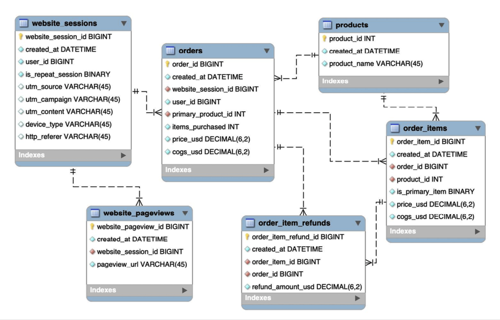

# Fuzzy Factory

1. Fuzzy Factory: an online retailer which has just launched their first product.

2. Language: MySQL

3. Objective:

- Access and explore the Fuzzy Factory database.
- Analyze and optimize the business’ marketing channels, website, and product portfolio.

